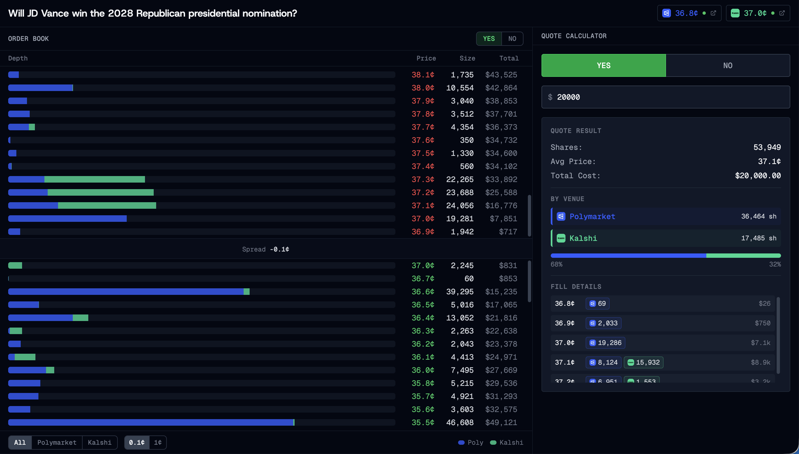

# Prediction Market Aggregator

A real-time order book aggregator that combines liquidity from multiple prediction market venues (Polymarket and Kalshi) into a unified view, with an integrated quote calculator for optimal order execution across venues.



## Features

- **Aggregated Order Book**: Real-time merged order book from Polymarket and Kalshi
- **Quote Calculator**: Calculates optimal fills across venues for a given dollar amount
- **Venue Breakdown**: Visual representation of liquidity distribution by venue
- **Live Updates**: WebSocket-based real-time data streaming

## Setup

```bash
npm install
npm run build && npm run start
```

The app will be available at `http://localhost:3000`.

> **Note:** `npm run dev` is not supported due to WebSocket conflicts with Next.js Turbopack's HMR.

---

## Key Design Decisions

### Why DFlow API instead of Kalshi Direct

I couldn't create accounts on Polymarket or Kalshi as Italy is geo-blocked, so I was limited to read-only public APIs. Polymarket's public API includes WebSocket streaming, but Kalshi's read-only access only provides REST endpoints - no real-time order book updates. [DFlow](https://dev-prediction-markets-api.dflow.net) aggregates and re-exposes Kalshi data with WebSocket support, enabling the real-time updates essential for an order book aggregator.

### Custom Server Architecture

Next.js App Router route handlers don't expose the underlying Node.js socket, so WebSockets can't be implemented in API routes (unlike the legacy Pages Router). 

Rather than running a separate backend service, we use a custom `server.ts` that wraps Next.js and attaches our WebSocket relay to the same HTTP server. This keeps the architecture simple: one process handles both page serving and real-time data streaming.

### UI/UX Inspiration

The interface draws inspiration from both Polymarket and Kalshi's trading UIs:

- **Stacked Depth Bars**: Unlike Polymarket and Kalshi which show cumulative depth (total liquidity up to that price), our bars show liquidity **at each specific price level**, with segments colored by venue (blue for Polymarket, green for Kalshi). This visualization intuitively shows:
  - Where liquidity is concentrated at specific prices (bar length)
  - Which venue provides that liquidity (color segments)
  - How liquidity is distributed across the price ladder

- **Quote Calculator Fill Details**: When calculating a quote, we show exactly which price levels are being filled from each venue. This transparency helps users understand how their order would be executed across the aggregated book.

- **Venue Status Pills**: The header shows real-time mid-prices from each venue with connection status indicators, linking directly to the source markets.

### Quote Algorithm

The quote calculator uses a simple greedy approach with two key principles:

1. **Price priority**: Fill all available liquidity at the best price before moving to the next level
2. **Venue stickiness**: At each price level, prefer the venue that's already providing most of the fills to minimize fragmentation across venues

This keeps execution concentrated on fewer venues when possible, which would reduce complexity if actual order routing were implemented.

---

## Assumptions & Tradeoffs

### Assumptions

- **Single Market Focus**: The app is currently hardcoded to a single market (JD Vance 2028 Republican nomination). The architecture supports multiple markets but the UI is optimized for single-market deep analysis.

- **Read-Only**: This is a visualization and quoting tool only - no order execution is implemented.

- **Price Normalization**: Both venues use 0-1 price ranges (representing probability), displayed as cents (0-100).

### Tradeoffs

- **DFlow Dependency**: Using DFlow for Kalshi data adds a third-party dependency. DFlow's connection appears less stable than the direct Polymarket WebSocket, occasionally requiring reconnection. We implemented REST snapshot fallback to mitigate this.

- **No Historical Data**: The order book only shows current state - no historical depth or time-series data is persisted.

- **Static Quote**: The quote calculator shows a point-in-time calculation. If the order book updates while viewing a quote, the displayed quote becomes stale (though a warning appears).

---

## Future Improvements

With more time, I would extend the app (as the very first features) with:

### Data & Backend

- **Historical Backfill**: Store order book snapshots to show how liquidity has evolved over time
- **Live Trade Feed**: Display incoming orders and trade executions in real-time
- **Order Execution**: Integrate with venue APIs to actually place orders
- **Multiple Markets & More Venues**: Support switching between different prediction markets and adding more venues (this of course is not trivial, it's more like the endgame)

### UI/UX

- **Normalized Depth Bars**: Currently, a single price level with massive liquidity (e.g., Kalshi's 1.3M shares at one price) makes all other bars appear tiny. Implementing log-scale or percentile-based normalization would improve readability.

- **Live Quote Updates**: Automatically recalculate and update the quote as the order book changes, rather than showing a stale warning.

- **Price Chart**: Add a price chart visualization alongside the order book ladder.

### Reliability

- **DFlow Connection Stability**: Investigate and improve the DFlow WebSocket connection reliability, potentially with more aggressive keepalive or fallback strategies.

---

## Tech Stack

- **Framework**: Next.js 16 (App Router)
- **Styling**: Tailwind CSS v4 / shadcn
- **WebSocket**: `ws` library for server, native WebSocket for client
